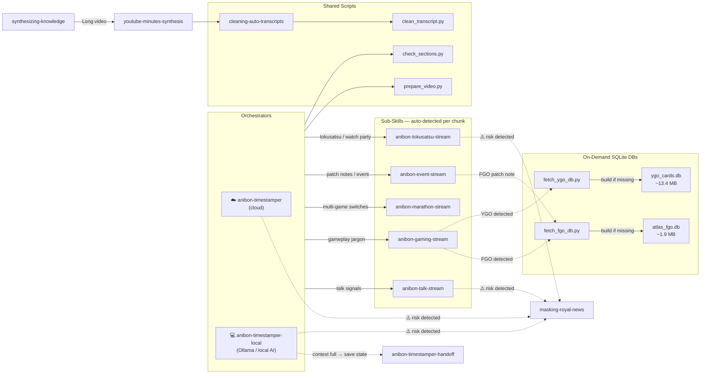

# 📚 Anibon Stream Synthesis Plugin

A suite of skills for deep research, transcript processing, and content synthesis. Works across **Antigravity CLI**, **Claude Code**, and **OpenCode**. Uses hierarchical MapReduce, censorship/masking pipes, and centralized script utilities.

## 🚀 Installation

**Antigravity CLI (`agy`)** — Install directly from GitHub:
```bash
agy plugin install https://github.com/zenithth/anibon-stream-synthesis
```
Or clone manually into the auto-discovery plugins directory:
```bash
cd ~/.gemini/config/plugins/
git clone https://github.com/zenithth/anibon-stream-synthesis.git
```

**OpenCode** — Install globally via the OpenCode CLI (recommended):
```bash
opencode plugin -g anibon-stream-synthesis@git+https://github.com/ZenitHTH/anibon-stream-synthesis.git
```
Or add the plugin directly to your global `~/.config/opencode/opencode.jsonc` (or project-level `opencode.jsonc`):
```json
{
  "plugin": ["anibon-stream-synthesis@git+https://github.com/ZenitHTH/anibon-stream-synthesis.git"]
}
```
Restart OpenCode. The plugin manager downloads the package automatically and registers all skills.

**Claude Code** — requires marketplace publication. Skills cannot be manually dropped into the plugin cache.

---

## 📺 Who is Anibon?

**Anibon** (specifically **Pu Boat** or "บ๊อต" from **Anibon Official**) is a prominent Thai content creator, streamer, and pop-culture/gaming commentator. His content covers gacha games (e.g., FGO, Honkai Impact/Star Rail), anime discussions, tokusatsu franchise watch parties, and patch-note theorycrafting.

### Why was `anibon-timestamper` created?

Boat's live streams are exceptionally long (often spanning **2 to 10+ hours**) and highly unstructured. During a single stream, he might transition chaotically from a game's gacha pulls to discussing recent Thai news (often masked in One Piece lore and metaphors), reading patch notes, and hosting watch parties.

Manually timestamping these massive, unpredictable streams is extremely time-consuming and prone to missing key transitions. The `anibon-timestamper` skill was created to automate this via a **hierarchical MapReduce workflow**—splitting long streams, cleaning transcription noise, auto-routing content chunks to specialized sub-skills, and ensuring formatting and safety compliance constraints are met without missing crucial moments.

---

## 🛠️ Skills

| Skill | Purpose | Key Integrations |
| :--- | :--- | :--- |
| [`synthesizing-knowledge`](skills/synthesizing-knowledge/SKILL.md) | Deep research & report synthesis | Delegates long videos to `youtube-minutes-synthesis` |
| [`youtube-minutes-synthesis`](skills/youtube-minutes-synthesis/SKILL.md) | Meeting-minutes from YouTube videos | Calls `cleaning-auto-transcripts` first |
| [`anibon-timestamper`](skills/anibon-timestamper/SKILL.md) | Stream orchestrator — auto-detects stream type & routes to sub-skills | Orchestrates all `anibon-*` sub-skills via parallel signal detection |
| [`anibon-timestamper-local`](skills/anibon-timestamper-local/SKILL.md) | Local stream orchestrator — sequential loop & goldfish brain rules | For local AIs (Ollama) with restricted context windows |
| [`anibon-timestamper-handoff`](skills/anibon-timestamper-handoff/SKILL.md) | Local timestamper session state saving & loading | Resolves context memory issues on long runs |
| [`cleaning-auto-transcripts`](skills/cleaning-auto-transcripts/SKILL.md) | Transcription noise correction | Powers `anibon-timestamper` and `youtube-minutes-synthesis` |
| [`masking-royal-news`](skills/masking-royal-news/SKILL.md) | Sensitive political/royal content masking | Single source of truth for public safety compliance |
| [`building-reusable-cli-tools`](skills/building-reusable-cli-tools/SKILL.md) | CLI tool design guidance | Referenced when writing new processing scripts |

### 🎬 anibon-timestamper Sub-Skills

Nested under [`skills/anibon-timestamper/skills/`](skills/anibon-timestamper/skills/). The orchestrator **auto-detects** which sub-skill(s) to load by scanning transcript signals — multiple sub-skills may be loaded simultaneously for mixed chunks.

| Sub-Skill | Detection Signal | Tags Used |
| :--- | :--- | :--- |
| [`anibon-talk-stream`](skills/anibon-timestamper/skills/anibon-talk-stream/SKILL.md) | Long monologues, reading chat, news, lore/story tangents, coded political talk | `[Talk]` `[News]` `[Chat]` `[Q&A]` `[Donation]` |
| [`anibon-gaming-stream`](skills/anibon-timestamper/skills/anibon-gaming-stream/SKILL.md) | Game-specific jargon dominates, sparse verbal reactions | `[Boss]` `[Death]` `[Victory]` `[Stage]` |
| [`anibon-marathon-stream`](skills/anibon-timestamper/skills/anibon-marathon-stream/SKILL.md) | Multiple distinct game titles appear in sequence | `[GameSwitch]` `[Session]` |
| [`anibon-event-stream`](skills/anibon-timestamper/skills/anibon-event-stream/SKILL.md) | Patch note reading, new event content, theorycrafting | `[Event]` `[PatchNote]` `[Theory]` |
| [`anibon-tokusatsu-stream`](skills/anibon-timestamper/skills/anibon-tokusatsu-stream/SKILL.md) | Tokusatsu franchise names (Kamen Rider, Super Sentai, Ultraman…), watch party, multi-speaker panel | `[WatchParty]` `[Reaction]` `[Discussion]` `[Lore]` `[Tierlist]` `[Review]` |

### 📖 Live Service Games Knowledge Base References

Nested under [`skills/anibon-timestamper/skills/reference/`](skills/anibon-timestamper/skills/reference/). These reference files provide structured lore and chronology for live service games discussed in stream chats and news.

*   [**miHoYo Connected Lore Reference**](skills/anibon-timestamper/skills/reference/miHoYo_Connected_Lore.md) - Deep dive connecting HI3 (Part 1, 1.5, Part 2, APHO), Honkai: Star Rail (Aeons, Path of Permanence, Welt Yang's journey), and Genshin Impact.
*   [**Honkai Impact 3rd Reference**](skills/anibon-timestamper/skills/reference/Honkai_Impact_3.md) - Part 1/1.5 chronology, terminology, battlesuits, and mechanics.
*   [**Honkai Impact 3rd Part 2 Reference**](skills/anibon-timestamper/skills/reference/Honkai_Impact_3_Part2.md) - Part 2 Mars chronology, characters, and battlesuits.
*   [**Honkai: Star Rail Reference**](skills/anibon-timestamper/skills/reference/Honkai_Star_Rail.md) - Patches, banner chronology, and meta team setups.
*   [**Genshin Impact Reference**](skills/anibon-timestamper/skills/reference/Genshin_Impact.md) - History of cities, Archons, Fatui Harbingers, and Descenders.
*   [**Wuthering Waves Reference**](skills/anibon-timestamper/skills/reference/Wuthering_Waves.md) - Character and version roadmap.
*   [**Zenless Zone Zero Reference**](skills/anibon-timestamper/skills/reference/Zenless_Zone_Zero.md) - Versions and agent factions.
*   [**Arknights Reference**](skills/anibon-timestamper/skills/reference/Arknights.md) - Version and chronology reference.
*   [**Arknights: Endfield Reference**](skills/anibon-timestamper/skills/reference/Arknights_Endfield.md) - Setup, dates, and gameplay mechanics.
*   [**Limbus Company Reference**](skills/anibon-timestamper/skills/reference/Limbus_Company.md) - Key event updates and gameplay styles.

#### ⚡ On-Demand SQLite Databases (Auto-Bootstrapped)

The following games have **large datasets** that are too big to ship as static files.
Instead, a lightweight SQLite DB is built on first use by running a bootstrap script.
Both scripts are idempotent — they skip the download if the local DB is already up-to-date.

| Game | DB File | Bootstrap Script | Source API | Size | Cards/Entities |
|---|---|---|---|---|---|
| **Fate/Grand Order** | [`FGO and DATA/atlas_fgo.db`](skills/anibon-timestamper/skills/reference/FGO%20and%20DATA/FGO_DB_Reference.md) | `scripts/fetch_fgo_db.py` | [Atlas Academy](https://api.atlasacademy.io) | ~1.9 MB | 470 servants, 2.6K CEs, 1.9K items… |
| **Yu-Gi-Oh! Duel Monsters** | [`Yu-Gi-Oh DATA/ygo_cards.db`](skills/anibon-timestamper/skills/reference/Yu-Gi-Oh%20DATA/YGO_DB_Reference.md) | `scripts/fetch_ygo_db.py` | [YGOPRODeck](https://db.ygoprodeck.com/api-guide/) | ~13.4 MB | 14,422 cards, 43,768 set prints, 640 archetypes |

> [!IMPORTANT]
> Always run `--check` before querying. If exit code is 1, run the build script first.
> See each game's `*_DB_Reference.md` for SQL query patterns and detection signals.


---

## 🧭 Skill Dependency Graph



---

## ⚙️ Shared Script Utilities & Native Tools

> [!IMPORTANT]
> **Ponytail Rule**: One script to rule them all. Never build complex multi-line bash/powershell prompt orchestrations when one simple Python script can handle cross-platform setup flawlessly.

All scripts live in `skills/anibon-timestamper/scripts/`. Locate them at runtime with:
```bash
find $HOME/.gemini $HOME/.config/opencode $HOME/.agents -name <script>.py 2>/dev/null | head -1
```

### `prepare_video.py` — The All-in-One Orchestrator
To avoid context bloat and path hallucination errors for local LLMs (like `gemma`), use this single script to safely create the `youtube_VIDEO_ID_workspace`, download the transcript via `yt-dlp`, and clean/chunk the data all at once:
```bash
python3 scripts/prepare_video.py <VIDEO_URL_OR_ID>
```

### `clean_transcript.py` — Space Normalization & MapReduce Chunking
Handles regex mappings, UTF-8 normalization (critical for Windows PowerShell output), and chunking.
```bash
# Clean an existing raw transcript using standard or custom mapping
python3 scripts/clean_transcript.py raw_transcript.json > cleaned_transcript.json

# Chunking mode (for MapReduce pipelines)
python3 scripts/clean_transcript.py raw_transcript.json --chunk --chunk-dir chunks --block 300 --overlap 30
```

### `check_sections.py` — YouTube Comment Size Checker
Run after assembly to automatically flag sections that are too long for YouTube comments (5,000-char Thai limit) and get the exact split timestamp at the section midpoint.
```bash
python3 scripts/check_sections.py timestamp_VIDEO_ID.md
# Output: ✅ OK / ⚠️ WARN (>4,500) / ❌ OVER (>5,000) per section
# Flagged sections → prints the timestamp to split at
```

### `fetch_fgo_db.py` — Fate/Grand Order DB Bootstrap
Downloads FGO JP data from [Atlas Academy API](https://api.atlasacademy.io) and builds `atlas_fgo.db` (~1.9 MB). Version-aware: skips download if local DB matches the live game version hash.
```bash
# Check if DB is valid (exit 0=ok, 1=missing/stale)
python3 scripts/fetch_fgo_db.py --check --db "skills/reference/FGO and DATA/atlas_fgo.db"

# Build (or refresh) the DB
python3 scripts/fetch_fgo_db.py --db "skills/reference/FGO and DATA/atlas_fgo.db"

# Force full re-download
python3 scripts/fetch_fgo_db.py --force --db "skills/reference/FGO and DATA/atlas_fgo.db"
```
See [`FGO_DB_Reference.md`](skills/anibon-timestamper/skills/reference/FGO%20and%20DATA/FGO_DB_Reference.md) for SQL query patterns.

### `fetch_ygo_db.py` — Yu-Gi-Oh! Card DB Bootstrap
Downloads all 14,400+ cards from [YGOPRODeck API](https://db.ygoprodeck.com/api-guide/) and builds `ygo_cards.db` (~13.4 MB). Paginated (2,000 cards/batch). Version-aware via `checkDBVer.php`.
```bash
# Check if DB is valid (exit 0=ok, 1=missing/stale)
python3 scripts/fetch_ygo_db.py --check --db "skills/reference/Yu-Gi-Oh DATA/ygo_cards.db"

# Build (or refresh) the DB
python3 scripts/fetch_ygo_db.py --db "skills/reference/Yu-Gi-Oh DATA/ygo_cards.db"

# Force full re-download
python3 scripts/fetch_ygo_db.py --force --db "skills/reference/Yu-Gi-Oh DATA/ygo_cards.db"
```
See [`YGO_DB_Reference.md`](skills/anibon-timestamper/skills/reference/Yu-Gi-Oh%20DATA/YGO_DB_Reference.md) for SQL query patterns and card schema.

---

## 🚀 Orchestration Patterns

### Parallel Research (synthesizing-knowledge)
3+ sub-topics or 5+ searches → spawn parallel subagents. Prevents context bloat in the main session.

### Hierarchical MapReduce (anibon-timestamper)
Streams > 2 hours → split into overlapping 5-min chunks.  
**Local LLM Guardrails (Goldfish Brain Protocol)**: Local LLMs have very limited working memory. They MUST:
1. **Locate Tools dynamically**: Use narrowed `find` commands to locate scripts within the skill directory instead of relying on hardcoded paths.
2. **One-to-One Files**: Write analysis for each chunk into uniquely named files (e.g., `chunk_00_output.md`) sequentially to prevent overwriting or hallucinating `bash` append syntax.
3. **Flush Context & Stop**: Mentally flush their scratchpad after each file is written, output a `[READY FOR NEXT CHUNK]` marker, and halt completely to wait for orchestrator confirmation.

**Final Assembly**: Use native PowerShell `Get-Content -Encoding UTF8 chunk_*_output.md | Set-Content -Encoding UTF8 timestamp_VIDEO_ID.md` to safely concatenate the final artifact.

### Conditional Safety Masking (masking-royal-news)
The `masking-royal-news` skill is **NOT applied by default**. It only triggers when the chunk contains actual legal-risk signals:

| Trigger | Signal |
|---|---|
| ✅ Mask | Boat directly names a royal figure (ร.10, ราชินีสุทิดา, พระองค์ภา…) |
| ✅ Mask | One Piece character names used **off-lore** (พูดถึง "อิมู" แต่เชื่อมกับ succession / ม.112) |
| ✅ Mask | Section 112 discussed in royal-specific context |
| ❌ No mask | General political party critique (ก้าวไกล, เพื่อไทย, ประชาธิปัตย์…) |
| ❌ No mask | Election / civil policy commentary |
| ❌ No mask | One Piece lore that is clearly about the anime itself |

**Quick test**: "ถ้าโพสต์ข้อความนี้ใน YouTube comment ตามตรง จะเสี่ยงต่อการฟ้องร้องตามมาตรา 112 ไหม?" — ถ้าไม่มี → ไม่ต้อง mask

---

## 🖥️ Multi-Tool Compatibility

Skills are tool-agnostic. Key conventions:

| Concept | Antigravity | Claude Code | OpenCode |
| :--- | :--- | :--- | :--- |
| Run shell command | `run_command` | `Bash` | native bash |
| Fetch web page | `read_url_content` | `WebFetch` | WebSearch/bash |
| Write file | `write_to_file` | `Write` | native write |
| Spawn subagents | `subagent-driven-development` | `Task` | concurrent tool calls |
| Working directory | artifacts dir (injected) | `~/.claude/brain/<session-id>/` | project subdir |
| Temp/scratch files | `scratch/` session dir | any session-scoped temp path | any session-scoped temp path |

Skill invocation uses plain names (`anibon-talk-stream`) — no tool-specific prefix needed.

---

## ⚖️ Iron Rules

1. **No hallucinated links** — every citation must be verified and active.
2. **Scratchpad before report** — write `<working_dir>/bibliography_draft.md` with all URLs before the final file.
3. **Parallel for broad topics** — 3+ sub-topics or 5+ searches → must use parallel subagents.
4. **Channel ownership** — if the channel is not Anibon Official, do not call the speaker "Boat".
5. **Check runtimes first** — verify `python3` / `node` are available before running scripts; use Python fallback if Node is missing.
6. **Ask on unknown terms** — phonetic mismatch → stop, show the user the timestamp and context, never guess.
7. **No ad-hoc scripts** — check `scripts/` first; only write a fallback if the file is genuinely missing.
8. **Run `check_sections.py` after assembly** — never count YouTube comment chars manually. Split until all sections show ✅.
9. **Anti-bot handling** — YouTube block → ask user for browser cookie permission immediately.
10. **Transcript required** — if unavailable, reject the task; never guess timestamps.

