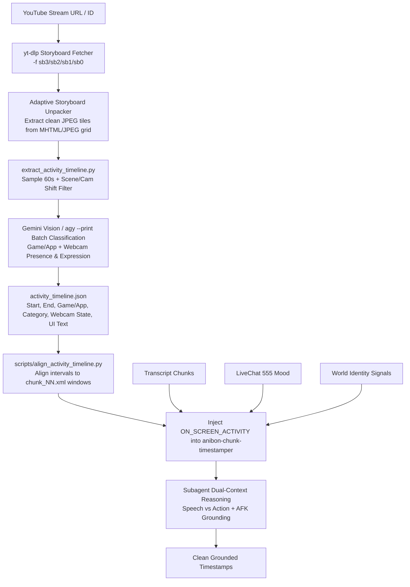

# Design Spec: `anibon-stream-activity` (Livestream Screen, Webcam & Activity Context)

**Date**: 2026-08-28  
**Status**: Validated Design  
**Skill**: `anibon-stream-activity`  
**Target Plugin**: `anibon-stream-synthesis`  

---

## 1. Problem Statement & Motivation

During long-form Anibon Official livestreams, speaker "Pu Boat" (โบ๊ต / PhuBoat) frequently multi-tasks:
- **Speech vs. Action Divergence**: Spoken dialogue often covers real-world topics (personal stories, news, political/social commentary, food banter, chat Q&A) while on-screen visuals show unrelated gameplay (farming mobs, grinding in Monster Hunter, sorting inventory, browsing Steam/Shopee/Reddit, or waiting in matchmaking queues).
- **Webcam / Facecam Context**: Pu Boat almost always streams with his webcam enabled (either as a corner overlay or full-screen during podcast segments). When he leaves his desk (AFK / bathroom break / grabbing food / interacting with his cat), the audio goes silent or ambient. Without webcam awareness, audio-only processing struggles to distinguish between an intentional break and an audio glitch.
- **Physical Emotion & Reactions**: Spoken audio and LiveChat `555` bursts don't always capture the full emotional context (e.g. silent laughing, facepalming, holding head in despair after a bad gacha roll, eating/drinking).
- **Failure Modes in Audio-Only Timestamping**:
  1. *Hallucinated Lore*: Misattributing real-world stories or personal anecdotes as in-game lore/quests for the game currently played.
  2. *Deictic Ambiguity*: Failing to resolve visual references like *"ดูอันนี้ดิ"*, *"เกมนี้ราคาเท่าไหร่"*, *"ตัวนี้โกงมาก"* when no explicit title or character name is spoken.
  3. *Context Gaps & AFK Misclassification*: Inability to explain sudden shouting, laughing, or long silent periods caused by unannounced in-game events or leaving the desk.
  4. *Blurry/Pixelated Vision*: Previous storyboard extraction (`sb0`) produced low-resolution 160x90 thumbnails unsuitable for reading on-screen UI text or inspecting webcam expressions.

---

## 2. Goals & Non-Goals

### Goals
- **High-Resolution Visual Sampling**: Automatically download the highest available storyboard tier (`sb3`/`sb2`/`sb1`/`sb0`) using `yt-dlp` to prevent pixelation during OCR, game identification, and webcam inspection.
- **Pre-flight Activity & Webcam Timeline**: Construct a lightweight, deterministic `activity_timeline.json` mapping stream timestamps to:
  1. *On-Screen Activity*: Game/app, category, state, on-screen text.
  2. *Webcam Status*: Speaker presence (`present` vs. `afk_empty_chair`), physical emotion/expression (`laughing`, `shocked_facepalm`, `serious`, `eating_drinking`, `neutral`), and layout mode (`corner_cam`, `fullscreen_cam`).
- **Orchestrator Integration**: Align the activity and webcam timeline to 5-minute transcript chunks and inject `ON_SCREEN_ACTIVITY` into `anibon-chunk-timestamper` subagents.
- **Speech-Primary Disambiguation Rules**: Direct subagents to prioritize spoken dialogue for timestamp descriptions when divergence occurs, annotating background activity cleanly in parentheses (e.g. `[Talk] เม้าท์มอยเรื่อง... (ระหว่างเล่น Monster Hunter)`), and correctly tagging AFK breaks (e.g. `[AFK] ปู่โบ๊ตลุกไปเข้าห้องน้ำ / พักเบรก`).

### Non-Goals
- Dual-track timestamp rendering (the output remains YouTube-compatible single-track timestamps with `═══` section blocks).
- Continuous per-second facial recognition or biometric tracking (samples every 60–90 seconds + scene change hashes to preserve speed and token efficiency).

---

## 3. System Architecture & Workflow



---

## 4. Component Details

### 4.1 High-Resolution Storyboard Downloader & Unpacker
- **Downloader**: Uses `yt-dlp` format selection prioritizing higher tiers:
  ```bash
  yt-dlp -f "sb3/sb2/sb1/sb0" "https://www.youtube.com/watch?v=<VIDEO_ID>" -o "<workspace>/frames/storyboard.%(ext)s"
  ```
- **Adaptive Unpacker (`unpack_storyboard.py`)**:
  - Detects container format (MHTML multipart or direct JPEG sprite sheet).
  - Reads image header resolution to automatically calculate grid dimensions (e.g., 3x3, 5x5, 10x10) and tile aspect ratio.
  - Slices crisp, native-resolution crops without interpolation blur or pixelation.

### 4.2 Activity & Webcam Extractor (`extract_activity_timeline.py`)
- **Sampling Strategy**:
  - Sample 1 frame every 60–90 seconds.
  - Compute fast frame-difference / histogram hash between adjacent frames. If difference > threshold (scene, app switch, or sudden fullscreen cam switch), insert an intermediate sample frame at the transition timestamp.
- **Vision Classification Prompt**:
  - Calls `agy` / Gemini Vision with structured JSON schema:
    ```json
    [
      {
        "timestamp": "HH:MM:SS",
        "app_or_game": "Monster Hunter Wilds",
        "category": "Gameplay | Menu/Inventory | Gacha | Web Browsing | Video Reaction | AFK/Intermission | Fullscreen Cam",
        "state": "Fighting Dosshaguma in Windward Plains",
        "on_screen_text": "QUEST COMPLETED",
        "webcam": {
          "speaker_present": true,
          "expression": "laughing | shocked_facepalm | serious | eating_drinking | neutral | away",
          "layout": "corner_cam | fullscreen_cam | no_cam"
        }
      }
    ]
    ```
- **Interval Merging**:
  - Groups adjacent frames sharing the same `app_or_game`, `category`, and speaker presence status into continuous intervals with `start` and `end` timestamps.
  - Writes output to `<workspace>/activity_timeline.json`.

### 4.3 Chunk Alignment (`align_activity_timeline.py`)
- Maps intervals in `activity_timeline.json` to the time ranges of `<workspace>/chunks/chunk_*.xml`.
- Outputs `<workspace>/activity/activity_chunk_NN.txt` containing a formatted summary ready for subagent injection.

### 4.4 Subagent Reasoning & Disambiguation Rules
Update `anibon-chunk-timestamper` and `references/subagent-prompt-template.md`:
1. **Divergence Rule (Speech ≠ Screen Action)**:
   - When Pu Boat is discussing a separate topic while casually playing/browsing:
     - Primary tag matches the talk (`[Talk]`, `[News]`, `[Question]`).
     - Mention the game context in parentheses: `[Talk] เม้าท์มอยเรื่อง... (ระหว่างเล่น Monster Hunter)`.
     - Strictly prohibit framing personal anecdotes as in-game lore.
2. **Convergence Rule (Speech = Screen Action)**:
   - When speech is directly reacting to the game:
     - Primary tag matches the gameplay event (`[Gameplay]`, `[Gacha]`, `[Reaction]`).
3. **Webcam & AFK Grounding Rule**:
   - When `speaker_present: false` (empty chair / away from desk) and audio is low or absent:
     - Tag as `[AFK] ปู่โบ๊ตลุกไปพักเบรก / เข้าห้องน้ำ` or omit if < 2 min.
     - Explains silent gaps cleanly and prevents false topic switching or hallucinatory stamps.
4. **Physical Emotion Grounding**:
   - When `webcam.expression` shows `laughing` or `shocked_facepalm`, cross-reference with LiveChat `555` pulses to reinforce authentic mood-bearing verbs in descriptions.
5. **Deictic Grounding**:
   - For phrases like *"ดูนี่ดิ"*, *"เกมนี้"*, *"ตัวนี้"*, resolve target names directly from `ON_SCREEN_ACTIVITY` and on-screen text.

---

## 5. Directory Structure & File Additions

```
plugins/anibon-stream-synthesis/
├── skills/
│   ├── anibon-stream-activity/
│   │   ├── SKILL.md
│   │   ├── scripts/
│   │   │   ├── unpack_storyboard.py
│   │   │   ├── extract_activity_timeline.py
│   │   │   └── align_activity_timeline.py
│   │   └── references/
│   │       └── activity_categories.md
│   ├── anibon-timestamper/
│   │   ├── SKILL.md (Update pipeline with Step 3.6 Activity & Webcam Timeline)
│   │   └── references/subagent-prompt-template.md (Update prompt template)
│   └── antigravity-vision-proxy/
│       └── SKILL.md (Update sb0 -> sb3 resolution guidance)
└── agents/
    └── anibon-chunk-timestamper.md (Update with Divergence, AFK & Webcam Emotion rules)
```

---

## 6. Error Handling & Fallback Policy

- **No Storyboard Available**: If `yt-dlp` finds no storyboard formats (e.g. newly published livestream still processing on YouTube servers), log a warning and proceed without `ON_SCREEN_ACTIVITY`. Subagents fall back gracefully to transcript + LiveChat analysis.
- **Vision Call Failure / Rate Limit**: If batch vision classification fails, leave intervals as coarse `Unclassified Activity` without halting the pipeline.
- **Corrupted Storyboard Files**: Fall back to next lower tier (`sb2` -> `sb1` -> `sb0`) automatically.

---

## 7. Verification & Testing

1. **Unit Tests**:
   - `tests/test_unpack_storyboard.py`: Test MHTML unpacking, dynamic grid calculation (3x3, 5x5, 10x10), and high-res frame cropping.
   - `tests/test_align_activity_timeline.py`: Test mapping intervals (including AFK breaks) across 5-minute chunk boundaries.
2. **Integration Verification**:
   - Run extraction script on sample VOD with known game switches and AFK breaks; verify `activity_timeline.json` captures both gameplay state and empty chair / AFK episodes accurately.
