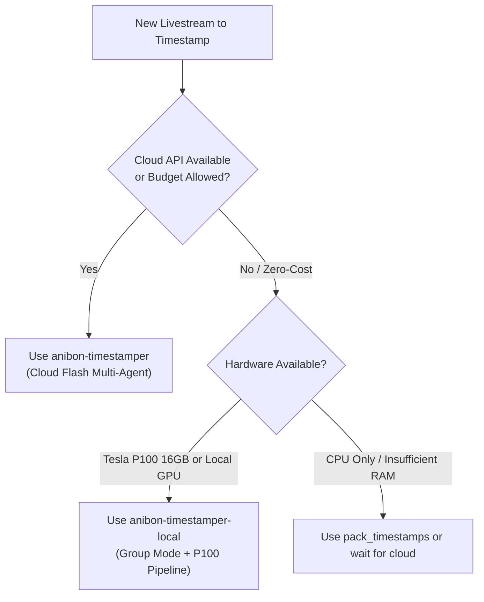

# Anibon Timestamper (Local P100 Edition)

## Overview

A fully local, zero-cloud-cost pipeline for generating front-tier quality YouTube timestamps from long livestreams on a single 16GB GPU (NVIDIA Tesla P100). Emulates the cloud multi-agent workflow via Group-based chunking (~16–20 min windows), multi-modal context fusion, tag normalization, and a two-pass local summarizer.

## When to Use



### Apply When:
- Generating timestamps for Anibon Official livestreams or long talk/gaming streams with **zero API expense**.
- Running local LLM inference on a dedicated workstation GPU (e.g. NVIDIA Tesla P100 16GB Pascal).
- Processing VODs where high topic coherence, banter emotion, and YouTube-ready comment parts are required.

### Do NOT Use When:
- Cloud API credits are available and maximum parallel speed (< 2 minutes runtime) is prioritized over zero cost (use `anibon-timestamper`).
- Processing short clips (< 10 minutes) where manual timestamping or simple heuristics suffice.

---

## Single-GPU Architecture (Tesla P100 16GB Envelope)

All operations run on a single machine, constrained strictly within 16GB VRAM (15.2 GB usable under Windows WDDM):

| Stage | Process / Model | Hardware Footprint | Purpose |
| :--- | :--- | :--- | :--- |
| **0. Pre-computation** | Python (yt-dlp, cv2, TF-IDF) | System RAM (0 MB VRAM) | Captions, LiveChat alignment, Storyboard activity, Domain signal detection. |
| **1. Pass 1: Group Stamping** | `google/gemma-4-12b-qat` (LM Studio) | ~7.2 GB VRAM + ~1.2 GB KV Cache | Processes 4 chunks per group (~16–20m), yielding 2–4 macro timestamps. |
| **2. Pass 2: Summarizer** | `google/gemma-4-12b-qat` (LM Studio) | Same instance (reused) | Clusters stamps into YouTube parts (< 3,500 bytes) with Caveman headers. |
| **3. Ground Truth (Opt)** | `whisper-cli.exe` (Large-v3-Turbo) | ~1.5 GB VRAM (Vulkan) / CPU | Transcribes short audio slices for garbled proper nouns on demand. |

**VRAM Safety Margin:** Peak allocation ~8.5–10.0 GB, leaving **5+ GB headroom** to prevent CUDA OOM or LM Studio model eviction.

---

## Core Pipeline & Quick Reference

### Quick Commands

```powershell
# 1. Download & Chunk (Skip if chunks/chunk_00.txt exists)
python "C:/Users/peter/.agents/skills/anibon-timestamper-local/scripts/prepare_video.py" "https://www.youtube.com/watch?v=<VIDEO_ID>" --workspace "C:/Users/peter/youtube_<VIDEO_ID>_workspace" --format txt --block 300 --overlap 30

# 2. Run All-in-One Local Timestamper (Group Mode + Summarizer Pass)
python -X utf8 "C:/Users/peter/.agents/skills/anibon-timestamper-local/scripts/process_chunks_local.py" "C:/Users/peter/youtube_<VIDEO_ID>_workspace" --group-size 4 --lang th

# 3. Detached Background Launch (for Cline / agent sessions with 30s timeout)
powershell -ExecutionPolicy Bypass -File "C:/Users/peter/.agents/skills/anibon-timestamper-local/scripts/launch_local.ps1" -Workspace "C:/Users/peter/youtube_<VIDEO_ID>_workspace"
```

---

## Discipline & Anti-Rationalization

### The Iron Rule of Local Processing

```
NEVER PROCESS 1 CHUNK IN ISOLATION WITHOUT GROUP CONTINUITY
```

Running single-chunk loops forces the model to generate a timestamp every 4 minutes, causing massive micro-stamping (37 stamps for 37 chunks) and fragmented topics.

### Rationalization Table

| Rationalization | Reality | Counter-Measure |
| :--- | :--- | :--- |
| *"Single chunk is faster to run."* | Fast but produces 30+ noisy, low-value stamps that fail benchmark review. | Use `--group-size 4` (~16–20m window). |
| *"I can invent tags like [วิเคราะห์] because it fits the content."* | Front-tier benchmarks reject non-standard tags; breaks comment parsers. | Normalizer automatically remaps `[วิเคราะห์]` → `[Talk]`. |
| *"I'll just summarize the whole 3-hour transcript in 1 prompt."* | Exceeds context and degrades entity recall on 12B models. | Group-based 4-chunk window keeps prompt under 4k tokens. |
| *"Let's write a custom Python script to speed this up."* | Ad-hoc scripts break state tracking, resume logic, and encoding. | Strictly use `process_chunks_local.py` flags. |

### Red Flags — STOP and Reset
- Output file contains 35+ timestamps for a 2-hour stream (micro-stamping symptom).
- Output tags include non-whitelisted words (`[วิเคราะห์]`, `[ชำแหละ]`, `[เปิดตัว]`).
- Sections exceed 3,500 bytes (YouTube comment limit violation).
- Script crashes with `UnicodeEncodeError: 'charmap'` (forgot `-X utf8`).

---

## Common Mistakes & Troubleshooting

1. **LM Studio Model Eviction**:
   - *Symptom*: LM Studio unloads Gemma 4 and reloads another model, causing 60-second stalls.
   - *Fix*: Keep `--model auto`. `resolve_model` automatically latches onto the active in-memory model.

2. **Gemma 4 Thinking Token Trap**:
   - *Symptom*: Output timestamp is blank or truncated.
   - *Cause*: Model used token budget in `reasoning_content`.
   - *Fix*: Built-in system prompt limits thinking to <2 sentences; client extracts timestamp directly from reasoning if content is blank.

3. **ASR Phonetic Drift**:
   - *Symptom*: Names like "นครโตะ" appear instead of "Naucrate (นอคราเต้)".
   - *Fix*: `process_chunks_local.py` loads `resources/default_mappings.json` and runs TF-IDF signal detection before prompt generation.
