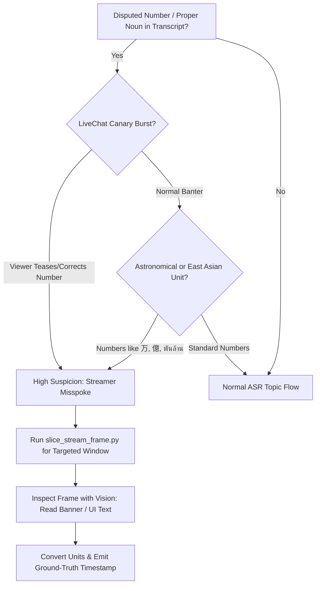

# Verifying Stream Ground Truth

## Overview

Visual ground truth (on-screen game banners, browser tabs, infocards) and real-time LiveChat listener reactions always supersede spoken ASR fluffs, streamer slip-ups, and LLM pre-training assumptions.

```
THE IRON RULE OF STREAM VERIFICATION:
Never guess from spoken slurs or pre-training memory when on-screen frames can be inspected.
```

---

## When to Use



### Mandatory Triggers:
1. **Disputed or Astronomical Numbers**: Streamer quotes impossible figures (e.g. *"3,500 ล้านดาวน์โหลด"*, *"30,000 กว่าล้าน"*).
2. **LiveChat Correction Canary**: Viewers actively tease, challenge, or correct the streamer in real time (*"35ล้านพอปู่ เยอะกว่าประชากรโลกละ"*).
3. **East Asian Unit Dissonance**: Dialogue references Japanese/Korean game campaigns where `万` (10,000) or `億` (100,000,000) was translated incorrectly.
4. **Ambiguous Deictic Pronouns**: Streamer says *"ดูอันนี้ดิ"*, *"ตู้ไหนดี"*, *"ตัวนี้เก่งมาก"* without naming the entity within ±30s.
5. **Explicit User Verification**: User prompts `/btw use vision`, `--vision`, or *"ลองใช้ vision เช็คดู"*.

### When NOT to Use:
- Static podcast/radio segments where the streamer merely chats over a static background image or webcam.
- Verbatim news article reading where the text matches known RSS/news transcripts.

---

## Quick Reference: 3-Step Verification Protocol

| Step | Action | Tool / Command |
| :--- | :--- | :--- |
| **1. Spot Canary** | Check LiveChat comments around timestamp for audience corrections. | Grep LiveChat / view transcript overlay |
| **2. Targeted Slice** | Download ONLY a 1–2 minute slice (instant ~2-3s download). | `python3 scripts/slice_stream_frame.py "<URL>" "HH:MM:SS"` |
| **3. Vision Grounding** | Inspect on-screen banner, calculate canonical number/name. | `view_file` on frame image or `agy --print` |

---

## Targeted Frame Extraction

Do NOT download multi-hour streams or wait for whole storyboard unpacks when verifying a single event.

### Automated Helper (Recommended)
Use the included helper script:

```bash
# Slices a 60-second window around 00:14:45 and outputs exact frame
python3 <skill-dir>/scripts/slice_stream_frame.py \
  "https://www.youtube.com/watch?v=VIDEO_ID" \
  "00:14:45" \
  -o "frames/banner_check.jpg"
```

### Manual CLI Alternative
```bash
# 1. Download targeted 720p clip (instant ~2-3s download via Chrome cookies)
yt-dlp --cookies-from-browser chrome \
  --download-sections "*00:14:15-00:15:15" \
  -f "bestvideo[height<=720]+bestaudio/best[height<=720]" \
  -o "target_slice.mp4" "https://www.youtube.com/watch?v=VIDEO_ID"

# 2. Extract exact frame at offset
ffmpeg -ss 00:00:30 -i target_slice.mp4.webm -frames:v 1 -q:v 2 target_frame.jpg -y
```

---

## Japanese & East Asian Unit Conversion Trap

Streamers often misread Japanese kanji units on the fly when sleep-deprived:

| Japanese Kanji | Numeric Value | Thai Equivalent | Streamer Misspeak Trap | Correct Translation |
| :--- | :--- | :--- | :--- | :--- |
| **万 (man)** | 10,000 | 1 หมื่น (หมื่น) | Reads `3500万` as *"3,500 ล้าน"* or *"3 หมื่นล้าน"* | `3,500 × 10,000` = **35,000,000 (35 ล้าน / 35M)** |
| **3000万** | 30,000,000 | 30 ล้าน | Confused with 30,000 ล้าน | **30 ล้าน (30M)** |
| **億 (oku)** | 100,000,000 | 100 ล้าน | Confused with พันล้าน | **100 ล้าน (100M)** |

---

## Rationalization Table & Red Flags

Agents under pressure find excuses to avoid visual inspection. Every excuse below is a violation:

| Rationalization / Excuse | Reality & Counter |
| :--- | :--- |
| *"Audio clearly says 30,000 so it must be 30M DL."* | Streamers misspeak constantly when tired. The on-screen banner is the authoritative source. |
| *"I remember FGO 30M DL happened in October, so there is no DL campaign here."* | Pre-training memory is fallible and dates shift across servers. Never let memory overrule the screen. |
| *"Downloading video takes too long and wastes bandwidth."* | `slice_stream_frame.py` uses `--download-sections` to fetch a tiny ~10MB slice in 2 seconds. |
| *"The transcript is enough to guess the topic."* | Guessing produces hallucinations that degrade audience trust. When challenged, verify with frames. |

### Red Flags - STOP and Run Vision
- Quoting download numbers > 1,000 ล้าน for a mobile game.
- Seeing LiveChat laugh (`555`, `ถถถ`) or type numbers immediately following streamer statements.
- Removing campaign titles entirely because "the streamer sounded confused".

---

## Common Mistakes

| Mistake | Prevention / Fix |
| :--- | :--- |
| **Downloading full stream video** | Always pass `--download-sections "*START-END"` to yt-dlp. |
| **HTTP 403 Forbidden on video stream** | Always pass `--cookies-from-browser chrome` to authenticate yt-dlp. |
| **Subagents hallucinating from fluffed speech** | Inject extracted frame OCR keywords into subagent prompts before timestamping. |
| **Ignoring LiveChat correction timestamps** | Cross-reference LiveChat comments within ±30 seconds of the controversial statement. |

---

## Real-World Impact (Case Study)

In Anibon stream `mJGd2XW8Tlg`:
- **Streamer Spoken Words**: *"ฉลอง 3,500 ล้านดาวน์โหลด... ตู้ 30,000 กว่าล้านเนี่ยผมพูดผิด"*
- **Baseline Failure**: Subagents hallucinated `30M DL`. Manual review falsely deduced no DL campaign existed at all and removed the tag.
- **Visual Ground Truth**: Running `slice_stream_frame.py` at `00:14:45` revealed the official banner: **`3500万DL突破キャンペーン`** (35M DL) + LiveChat correcting *"35ล้านพอปู่ 3หมื่นล้านเยอะกว่าประชากรโลกละ"*.
- **Result**: Corrected to `35M DL` with 100% precision.
