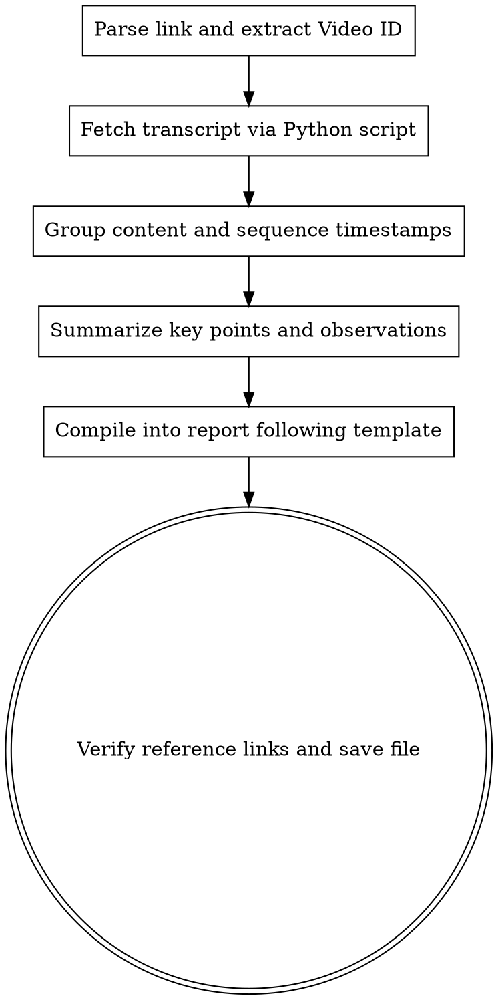

# YouTube Minutes Synthesis

A skill for extracting transcripts from YouTube videos, processing and analyzing them, and producing structured meeting-minutes-style summaries or timestamped overviews as Markdown (.md) documents.

## When to Use

- When the user needs meeting minutes from a recorded meeting or stream posted on YouTube.
- When summarizing key points from a long live stream, interview, or educational video with timestamps for easy reference.
- When repurposing a video transcript into an article or guide.

## Process Flow



## Checklist

You MUST always follow these steps when this skill is activated:

> [!IMPORTANT]
> **REQUIRED SUB-SKILL (FIRST):** Before anything else, run `preparing-tools` to verify all system dependencies (`yt-dlp`, `python3`). Do NOT proceed if any tool is missing.

1. **Verify Video ID & Publish Date — REQUIRED**: Extract the 11-character Video ID from the user-provided URL **AND verify the video's public publish date** (e.g. `upload_date` or `release_timestamp` from `yt-dlp --dump-json <URL>`, or look it up on the video's YouTube page) to establish the correct temporal context before analyzing any content. Always record the publish date in the report metadata.
   - If the video is older than 6 months, add a note: **"Old video — context may differ from the present"** in the report.
   - **NEVER attribute events or information that occurred after the publish date** to the speaker as if they said it, unless clearly labelled as **Post-stream Developments**.
2. **Extract Transcript**:
   - **REQUIRED SUB-SKILL**: To load or fetch a transcript, ALWAYS invoke the [cleaning-auto-transcripts](../cleaning-auto-transcripts/SKILL.md) skill to download and correct errors from the Auto-Transcript system or unclear speech.
   - **CRITICAL for Low-Context AIs (e.g. gemma4:e2b or gemma:31b)**: Do NOT use complex python scripts (e.g., `python3 "/absolute/path/to/scripts/prepare_video.py" "VIDEO_URL" --format json`) or guess dynamic filenames. Download the transcript into a predictable JSON file (literally named `raw_transcript.json` in your current directory) using this native command. **ALWAYS prioritize original language** (`--sub-lang "th-orig"` or `"en-orig"`) over English (`en`):
     `yt-dlp --write-auto-subs --sub-lang "th-orig" --sub-format json3 --skip-download --ignore-no-formats-error -o "raw_transcript" "<URL>" ; mv raw_transcript.*.json3 raw_transcript.json`
   - **Anti-Bot Block Handling (YouTube 429 Error)**:
     - **Local run**: Ask the user which browser they use (e.g., `chrome`, `brave`) and retry with `--cookies-from-browser <browser_name>`.
     - **OpenCode / Cloud Sandbox run**: `--cookies-from-browser` WILL FAIL. Ask the user to run the `yt-dlp` command locally and upload `raw_transcript.json` to the session.
   - If no speaker-specific error mapping file exists, just proceed with the `raw_transcript.json` using the standard filters.
3. **Organize Agenda**:
    - Divide the video timeline into main agenda items using a **Hierarchical MapReduce** approach:
      - **Map**: Group transcript records into 10-15 minute blocks with a 2-minute sliding overlap to ensure sentence cohesion.
      - **Reduce**: Synthesize the block summaries into high-level agenda sections, aligning main points with sub-ideas.
4. **Summarize Core Points**:
   - Summarize who said what, what conclusions or opinions were expressed during each segment.
   - **NEVER skip important details** and preserve the accuracy of the original context.
5. **Translate & Refine Language**:
   - Write the report in consistent, polished language throughout the entire document (e.g. all Thai or all English).
6. **Save to Markdown**: Save the document to the output store and provide the user with an accessible link.

## Recommended Template

```markdown
# Content Summary & Key Agenda from Video: [Topic/Video Title]

> **Source Video**: [Video clip name](real_YouTube_link)
> **Video Publish Date**: [Day/Month/Year the video was first published publicly]
> **Video Duration**: [e.g. 1 hour 30 minutes]
> **Date Recorded**: [Specify the date this report was last updated]
> **Primary Speaker / Host**: [Name if available]

---

## 1. Executive Summary
[2-3 sentences summarizing the key substance of the video]

## 2. Discussion Agenda with Timestamps

### [HH:MM:SS] Segment 1: [Key Topic]
* **Main Point**: [Details of what was discussed]
* **Suggestions & Conclusions**: [Opinions or agreements reached]

### [HH:MM:SS] Segment 2: [Next Topic]
* **Main Point**: [Details of what was discussed]

## 3. Action Items & Takeaways
- [ ] **Action Item 1** - [Specify responsible party or target]
- **Key crystallized insight**: [Major conclusion from the clip]

---

## References
- [Channel Name / Original Video Title](real_YouTube_link) - Original video that is the source of this report
```

## Troubleshooting & Fallback Strategies

For videos with access restrictions (age-restricted, private, or captions disabled):

1. **Age-restricted / Sign-in required**:
   - Since YouTube blocks bots from logging in to fetch captions for age-restricted content, switch to a **"Fallback to Web Search"** plan.
   - Search for summaries, reports, official press releases, or timestamps of that video online via Web Search.
   - Use the gathered data to map against activity timeframes and write the meeting report following the template.
3. **Manual Input**:
   - If the content is highly sensitive and not publicly disclosed, ask the user to open the clip in their main browser, copy the text from the captions panel (Show transcript), and paste it directly into the chat.

## Iron Rules
- **ALWAYS verify publish date first (REQUIRED)**: NEVER skip the `upload_date` / `release_timestamp` check. Always record the publish date in the report before starting, and **NEVER attribute post-publish-date events** to the speaker as if said during the clip.
- **Preserve timestamp accuracy**: Timestamp markers in the report must match the actual video time.
- **No Hallucinated Links**: YouTube reference links must be real, working links.
- **Write concisely yet comprehensively**: Summarize precisely without dropping the speaker's key substance.
